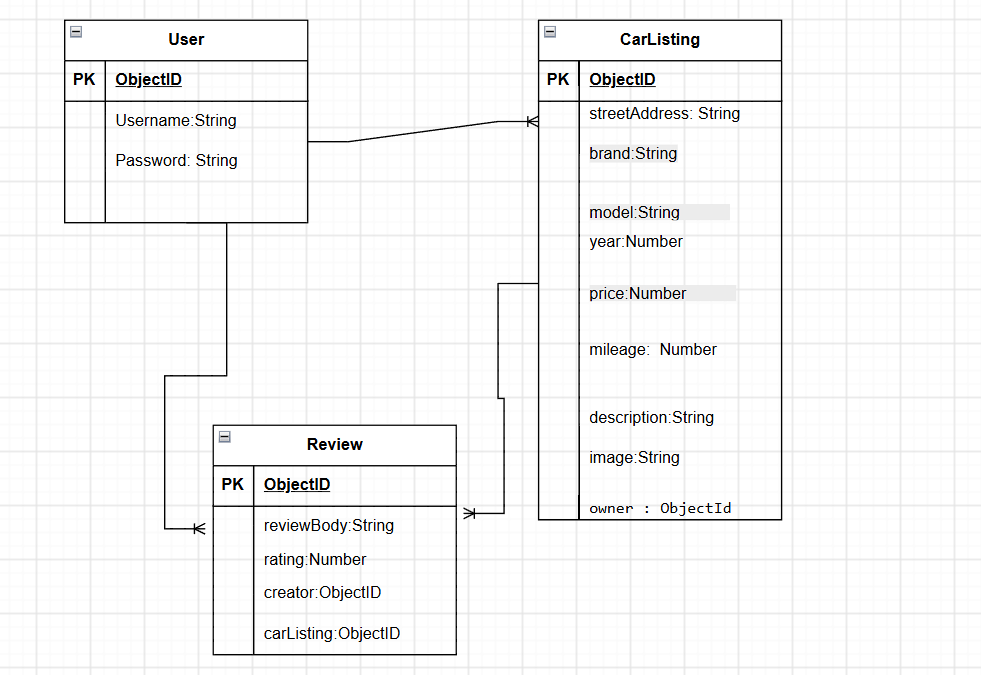
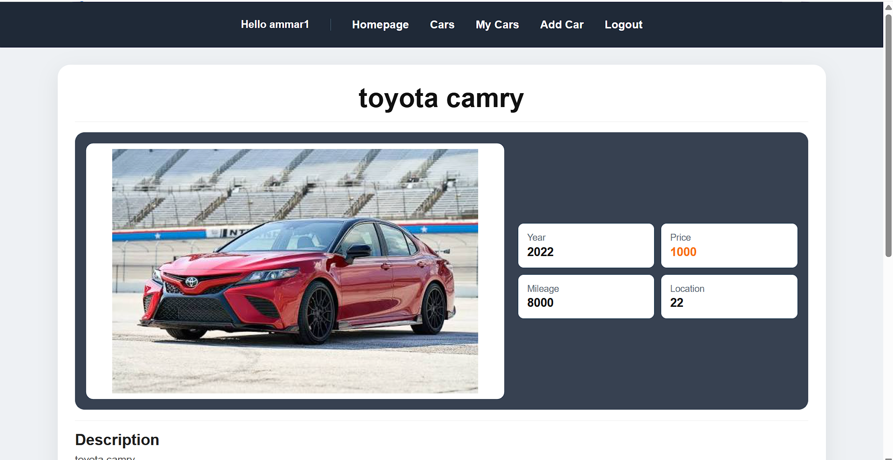

# Car Marketplace

## Overview

Car Marketplace is a web application where users can list their cars for sale and browse cars listed by other users.

Users can create an account, add their cars, edit or delete their listings, view car details, view their own cars, and leave reviews on cars.

## Screenshots

### ERD

### Home Page

### Car Details Page

## Technologies Used

- Node.js
- Express.js
- MongoDB
- Mongoose
- EJS
- JavaScript
- HTML
- CSS
- Multer
- Git & GitHub

## Getting Started

1. Clone the repository.
2. Install the required dependencies.
3. Create a `.env` file.
4. Add the MongoDB connection string and session secret.
5. Run the application locally.

## User Stories

### Authentication

- As a user, I want to create an account so that I can use the marketplace.
- As a user, I want to log in so that I can manage my car listings.
- As a user, I want to log out so that my account remains secure.

### Cars

- As a user, I want to view all available cars so that I can find a car to buy.
- As a user, I want to view the details of a car so that I can learn more about it.
- As a user, I want to add a car listing so that I can sell my car.
- As a user, I want to upload an image of my car so that buyers can see it.
- As a user, I want to view my own cars so that I can manage my listings.
- As a user, I want to edit my car listing so that I can update its information.
- As a user, I want to delete my car listing so that I can remove a car I am no longer selling.

### Reviews

- As a user, I want to leave a review on a car so that I can share my experience.
- As a user, I want to view reviews on a car so that I can see other users' opinions.
- As a user, I want to delete my own review so that I can remove a review I no longer want.

## Database Design

The application uses three main models:

### User

- `_id`
- `username`
- `password`

### CarListing

- `_id`
- `streetAddress`
- `brand`
- `model`
- `year`
- `price`
- `mileage`
- `description`
- `image`
- `owner`

### Review

- `_id`
- `reviewBody`
- `rating`
- `creator`
- `carListing`

### Relationships

- A User can own many CarListings.
- A User can write many Reviews.
- A CarListing can have many Reviews.
- Each CarListing belongs to one User.
- Each Review belongs to one User and one CarListing.

## Routes

### Home Route

| **Method** | **Route** | **Description**       |
| ---------- | --------- | --------------------- |
| GET        | `/`       | Display the home page |

### Authentication Routes

| **Method** | **Route**        | **Description**           |
| ---------- | ---------------- | ------------------------- |
| GET        | `/auth/sign-up`  | Display the sign-up form  |
| POST       | `/auth/sign-up`  | Create a new user account |
| GET        | `/auth/sign-in`  | Display the sign-in form  |
| POST       | `/auth/sign-in`  | Sign in a user            |
| GET        | `/auth/sign-out` | Sign out the current user |

### Car Listing Routes

| **Method** | **Route**                   | **Description**                  |
| ---------- | --------------------------- | -------------------------------- |
| GET        | `/car-listings`             | Display all car listings         |
| GET        | `/car-listings/my-cars`     | Display the user's own cars      |
| GET        | `/car-listings/new`         | Display the new car listing form |
| POST       | `/car-listings`             | Create a new car listing         |
| GET        | `/car-listings/:carId`      | Display one car listing          |
| GET        | `/car-listings/:carId/edit` | Display the car edit form        |
| PUT        | `/car-listings/:carId`      | Update a car listing              |
| DELETE     | `/car-listings/:carId`      | Delete a car listing              |

### Review Routes

| **Method** | **Route**                                 | **Description**     |
| ---------- | ----------------------------------------- | ------------------- |
| POST       | `/car-listings/:carId/reviews`            | Create a new review |
| DELETE     | `/car-listings/:carId/reviews/:reviewId`  | Delete a review     |

## Features

- User authentication
- Create car listings
- Upload car images
- View all car listings
- View individual car details
- View user's own car listings
- Edit car listings
- Delete car listings
- Add reviews
- Delete own reviews
- User ownership of car listings
- User ownership of reviews
- Store car images in the `public/uploads` directory

## Future Enhancements

- Search for cars
- Filter cars by brand and price
- Add favorites
- Add messaging between buyers and sellers
- Add advanced car filters

## Credits

Created by Ammar Yaser.